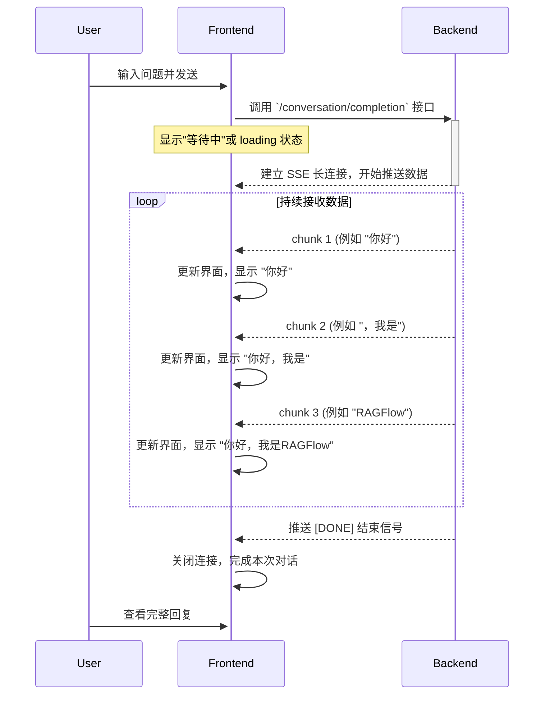

# RAGFlow `/conversation/completion` 接口前端实现指南

本文档详细说明了如何处理 RAGFlow 的 `/conversation/completion` 流式接口，并将其数据显示在前端界面上，旨在帮助开发者在其他项目中复现类似功能。

## 一、核心概念：流式响应 (Streaming)

`/conversation/completion` 接口使用 [Server-Sent Events (SSE)](https://developer.mozilla.org/en-US/docs/Web/API/Server-sent_events/Using_server-sent_events) 技术。与一次性返回所有数据的传统 HTTP 请求不同，SSE 允许服务器持续向客户端推送数据流。

在聊天场景中，这意味着大模型的每个生成的词或句子都可以作为一个独立的事件块被发送，前端接收到后立即渲染，用户就能看到打字机一样的实时效果。

## 二、数据流转示意图



## 三、前端实现步骤

### 1. 数据结构定义

首先，定义清晰的 TypeScript 接口来管理聊天消息。

```typescript
// 单条消息的结构
interface IMessage {
  id: string; // 唯一ID，用于React的key
  role: 'user' | 'assistant'; // 消息发送者
  content: string; // 消息内容
  isStreaming?: boolean; // 是否正在流式接收
}

// 聊天界面的状态
interface IChatState {
  messages: IMessage[]; // 消息列表
  isLoading: boolean; // 是否正在等待回复
  error?: string; // 错误信息
}
```

### 2. 调用流式接口

我们使用原生的 `fetch` API 来处理 SSE 请求。`fetch` 返回的 `ReadableStream` 可以让我们逐块读取数据。

```typescript
async function fetchStreamCompletion(chatHistory: IMessage[], question: string) {
  try {
    const response = await fetch('/api/v1/conversation/completion', {
      method: 'POST',
      headers: {
        'Content-Type': 'application/json',
        'Authorization': `Bearer YOUR_API_TOKEN`, // 替换为你的Token
      },
      body: JSON.stringify({
        "chat_history": chatHistory,
        "question": question,
        "stream": true // **必须设置为 true**
      }),
    });

    if (!response.body) {
      throw new Error("响应体为空");
    }

    // 处理数据流
    await processStream(response.body);

  } catch (error) {
    console.error('流式请求失败:', error);
    // 在UI上显示错误
  }
}
```

### 3. 解析数据流

这是整个流程的核心。我们需要一个 `ReadableStreamDefaultReader` 和一个 `TextDecoder` 来读取和解码 `Uint8Array` 格式的数据块。

```typescript
// 在你的 React 组件中
// const [messages, setMessages] = useState<IMessage[]>([]);

async function processStream(stream: ReadableStream<Uint8Array>) {
  const reader = stream.getReader();
  const decoder = new TextDecoder('utf-8');
  let assistantResponse = ''; // 存储当前助手的完整回复
  let currentAssistantMessageId: string | null = null; // 当前助手消息的ID

  while (true) {
    const { done, value } = await reader.read();
    if (done) {
      // 流结束，将最后一条消息的 isStreaming 状态设为 false
      setMessages(prev => prev.map(msg => 
        msg.id === currentAssistantMessageId ? { ...msg, isStreaming: false } : msg
      ));
      break;
    }

    const chunk = decoder.decode(value, { stream: true });
    
    // SSE 的数据格式通常是 `data: {...}\n\n`
    // 我们需要处理可能一次性收到多个 data 块的情况
    const lines = chunk.split('\n\n');

    for (const line of lines) {
      if (line.startsWith('data: ')) {
        const dataStr = line.substring(6);

        if (dataStr.trim() === '[DONE]') {
          // 这是RAGFlow约定的结束信号
          continue; 
        }

        try {
          const jsonData = JSON.parse(dataStr);
          const deltaContent = jsonData.answer || '';
          
          if (deltaContent) {
            assistantResponse += deltaContent;

            // 如果是第一个数据块，创建一条新的助手消息
            if (!currentAssistantMessageId) {
              const newId = `assistant-${Date.now()}`;
              currentAssistantMessageId = newId;
              setMessages(prev => [
                ...prev,
                { id: newId, role: 'assistant', content: assistantResponse, isStreaming: true }
              ]);
            } else {
              // 否则，更新最后一条助手消息
              setMessages(prev => prev.map(msg => 
                msg.id === currentAssistantMessageId ? { ...msg, content: assistantResponse } : msg
              ));
            }
          }
        } catch (e) {
          console.error('JSON解析失败:', dataStr, e);
        }
      }
    }
  }
}
```

### 4. 界面渲染

前端渲染逻辑需要处理“打字中”的效果，通常通过在助手消息的末尾添加一个闪烁的光标来实现。

```jsx
// Message.tsx 组件
function Message({ message }: { message: IMessage }) {
  // 使用 react-markdown 来渲染 markdown 内容
  return (
    <div className={`message ${message.role}`}>
      <ReactMarkdown>
        {message.content}
      </ReactMarkdown>
      {/* 如果正在流式传输，显示一个闪烁的光标 */}
      {message.isStreaming && <span className="blinking-cursor">|</span>}
    </div>
  );
}

// ChatWindow.tsx 组件
function ChatWindow() {
  const [messages, setMessages] = useState<IMessage[]>([]);
  
  // ... 其他逻辑 ...

  return (
    <div className="chat-window">
      {messages.map(msg => <Message key={msg.id} message={msg} />)}
    </div>
  );
}
```

### 5. CSS 样式

为闪烁的光标添加简单的 CSS 动画。

```css
@keyframes blink {
  50% { opacity: 0; }
}

.blinking-cursor {
  font-weight: bold;
  animation: blink 1s step-start 0s infinite;
}
```

## 四、总结与最佳实践

1.  **明确的结束信号**：后端必须在流结束后发送一个明确的信号（如 `data: [DONE]\n\n`），前端以此为依据来关闭连接和停止UI更新。
2.  **错误处理**：网络请求和数据解析都可能失败。需要有健壮的 `try-catch` 逻辑，并在界面上向用户反馈错误。
3.  **状态管理**：使用 `isStreaming` 这样的状态来控制UI效果（如显示光标、禁用发送按钮等），可以让用户体验更流畅。
4.  **增量更新**：每次收到新的数据块时，不是替换整个消息内容，而是在原有内容上进行追加，这是实现打字机效果的关键。
5.  **组件化**：将消息展示、输入框等拆分成独立的 React 组件，使代码更清晰、易于维护。

遵循以上步骤，你就可以在自己的项目中成功集成一个功能完善、体验流畅的流式聊天界面。 